# Cat that Got the Cream Cafe

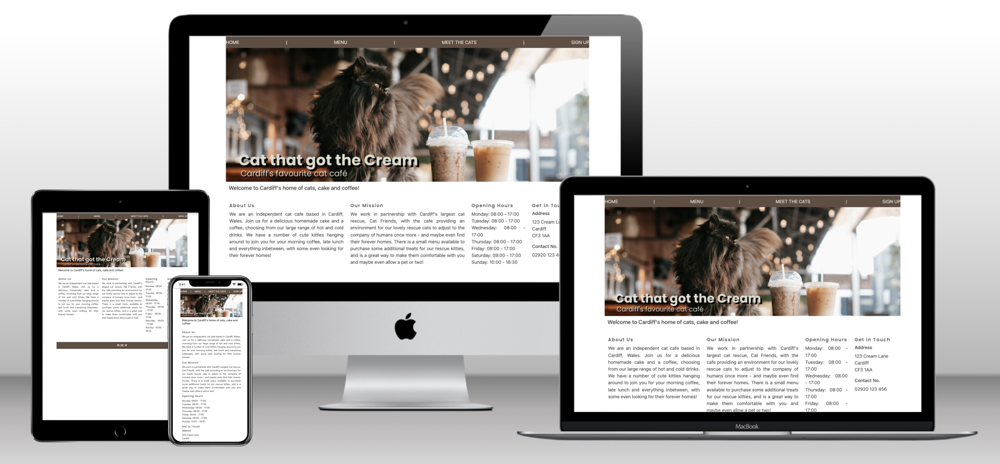

## Existing Features

### Navigation Bar
* The navigation bar is present in the header at the top of every page. It is fully responsive and links to the Home, Menu, Meet the Cats and Sign Up pages of the site.
* The navigation bar includes interactive links that change colour when hovered over.
* The bar allows the user to navigate easily between each of the pages without the use of the browser's 'back' button.

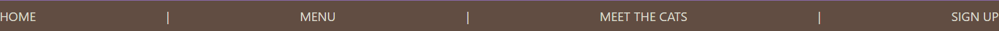
 
 ### Hero Image
 * The hero image is present on the home page (index.html) that includes the page's heading and subheading within it.
 * The image is fully responsive and resizes based on the width of the device it is being viewed on.
 * The image ties in with the colour scheme of the rest of the website.

 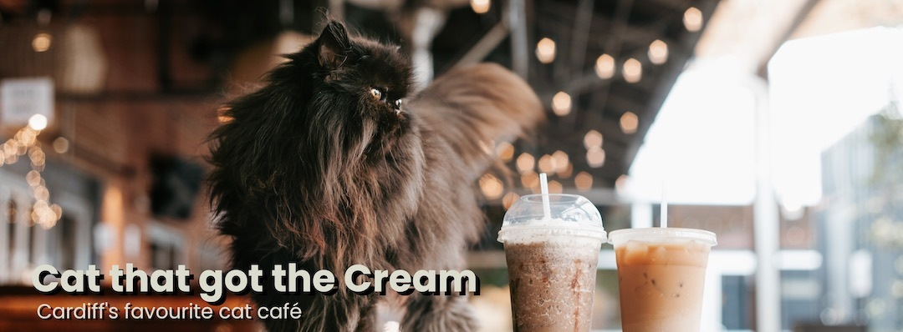

### Index Sections
* The sections on the homepage give information about the cafe and what to expect when you visit.
* There is contact information included, as well as opening times and the address of the cafe.

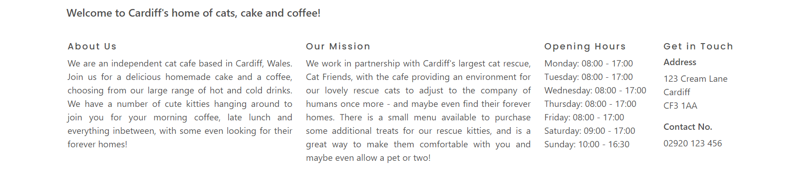

### Footer
* The footer includes clickable social media icons that open in a separate tab, and change colour when hovered over.
* These icons take you directly to the cafe's social media page for each respective icon, opening in a separate tab, and allows the user to keep updated with the cafe.

### Menus
* The Menu page displays the menus which show customers the range of food and drink available at the cafe.
* There are food, drink, and cat treat menus available currently.

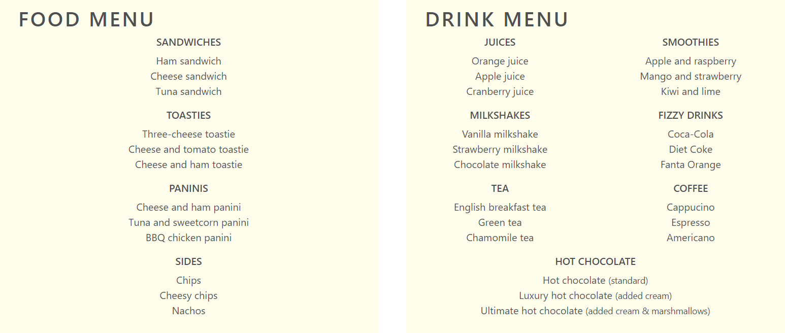

### Meet the Cats
* The Meet the Cats page allows users to view the current cats resident at the cafe.
* There is a picture of each cat alongside a short description.

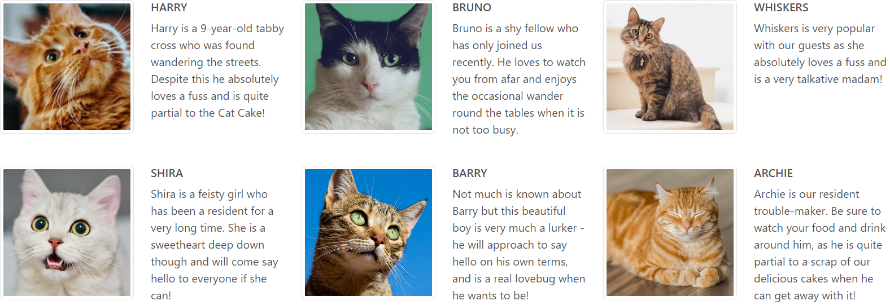

### Sign-Up Form
* The sign-up form provides fields for the user to enter their name and email address to keep up with updates on the cats and receive exclusive discounts.

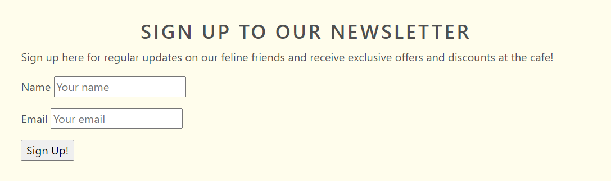

## Future Features
* Additional page to apply to adopt the available cats online.
* Additional Lunch menu added to the Menu page.
* A feedback survey where you can enter to be in with a chance to win gift vouchers for the cafe.

## User Experience (UX/UI)

### Site Goals

As a user I want to be able to find out more about the cafe, the cats available to visit, the food and drinks served, and details about the cafe like the address and how to get in touch.

 ### User Stories

* First Time Visitor Goals
    * As a first time visitor, I want to be able to easily navigate between the site pages.
    * As a first time visitor, I want to see the range of cats available to visit and find out more about them.
    * As a first time visitor, I want to easily view the menu to see the food available, opening times and how to get to the cafe.

* Returning Visitor Goals

    * As a returning visitor, I want to easily find social media links to see updated photos and information on the cats.
    * As a returning visitor, I want to see if there have been any cats adopted or added since my last visit.

* Frequent Visitor Goals

    * As a frequent visitor, I want to check if the menu has changed or any items have been added.
    * As a frequent visitor, I want to sign up to a newsletter for updates on the cats.

### Design
* Colour Scheme:
    * I have based the colour scheme around my hero image, the primary colours used are browns and creams.
* Typography:
    * I have primarily used the Poppins font.
    * I have used Sans Serif as the fallback in case of errors with importing fonts into the site.

* Imagery:
    * I have used images of various cats from Unsplash (see Credit section below for direct links).

### Wireframes
* [Index page wireframe](assets/images/wireframe-index-page.png)
* [Menu wireframe](assets/images/wireframe-menu-page.png)
* [Meet the Cats wireframe](assets/images/wireframe-cats-page.png)
* [Mobile wireframe](assets/images/wireframe-phone.png)

## Testing Features

| Feature | Expectation | Action | Result |
| -------- | -------- | ----- | ----|
| Navigation bar links | When clicking on each link, you will be taken to the respective page. | Clicked on Home, Menu, Meet the Cats and Sign-Up links. | User is successfully taken to the appropriate page. |
| Navigation bar hover | When hovering over each link, it will change colour. | Hovered over Home, Menu, Meet the Cats and Sign-Up links. | Links successfully change colour when hovered over. |
| Sign-Up Form | If user does not fill in both fields, a message will appear when trying to submit. | Entered one field, left the other blank and clicked 'Sign Up!' button. | Error message 'Please fill in this field.' appears.
| Social Media Icon Links | When clicking on each icon, you will be taken to the respective social media page in a new tab. | Clicked on each icon. | User is successfully directed to the appropriate site in a new tab.
| Social Media Icon Hover | When hovering on each icon, it will change colour. | Hovered over each icon. | Icons successfully change colour when hovered over. |

## Testing User Stories
### First Time Visitor Goals & Solutions
* As a first time visitor, I want to be able to easily navigate between the site pages.
    * The nav bar is located at the top of each page of the site for easy navigation. It is simplistic in design and straightforward to use.
* As a first time visitor, I want to see the range of cats available to visit and find out more about them.
    * The 'Meet the Cats' page has images of the cats currently in the café as well as a short description for each cat.
* As a first time visitor, I want to easily view the menu to see the food available, opening times and how to get to the café.
    * The opening times and location of the café is situated clearly on the front page, and the menu page can be viewed directly by clicking 'Menu' on the nav bar, clearly displayed at the top of the page.

### Returning Visitor Goals & Solutions

* As a returning visitor, I want to easily find social media links to see updated photos and information on the cats.
    * I have included social media links in the footer, easily accessible via footer icons on every page on the site.
* As a returning visitor, I want to see if there have been any cats adopted or added since my last visit.
    * The site will be updated regularly as and when the cats change; the 'Meet the Cats' page can be easily updated by adding additional rows where needed. 

### Frequent Visitor Goals & Solutions

* As a frequent visitor, I want to check if the menu has changed or any items have been added.
    * The menu will be updated as and when menu items change, this can be easily amended on the 'Menu' page.
* As a frequent visitor, I want to sign up to a newsletter for updates on the cats.
    * There is a sign-up form on its own page accessed via the main nav bar and is simplistic to use; the user simply enters their name and email address and clicks submit.

## Device Responsiveness
### Index Page Tested On:
* [15.6" Laptop Display](assets/images/preview-laptop-index.png)
* [Pixel 5 Display](assets/images/preview-pixel5-index.png)
* [iPad Air Display](assets/images/preview-ipadair-index.png)

### Menu Page Tested On:
* [15.6" Laptop Display](assets/images/preview-laptop-menu.png)
* [Pixel 5 Display](assets/images/preview-pixel5-menu.png)
* [iPad Air Display](assets/images/preview-ipadair-menu.png)

### Meet the Cats Page Tested On:
* [15.6" Laptop Display](assets/images/preview-laptop-cats.png)
* [Pixel 5 Display](assets/images/preview-pixel5-cats.png)
* [iPad Air Display](assets/images/preview-ipadair-cats.png)

### Sign Up Page Tested On:
* [15.6" Laptop Display](assets/images/preview-laptop-signup.png)
* [Pixel 5 Display](assets/images/preview-pixel5-signup.png)
* [iPad Air Display](assets/images/preview-ipadair-signup.png)

## Validator Testing

* HTML
    * No errors were returned when checking via the official [W3C validator](https://validator.w3.org/nu/):

    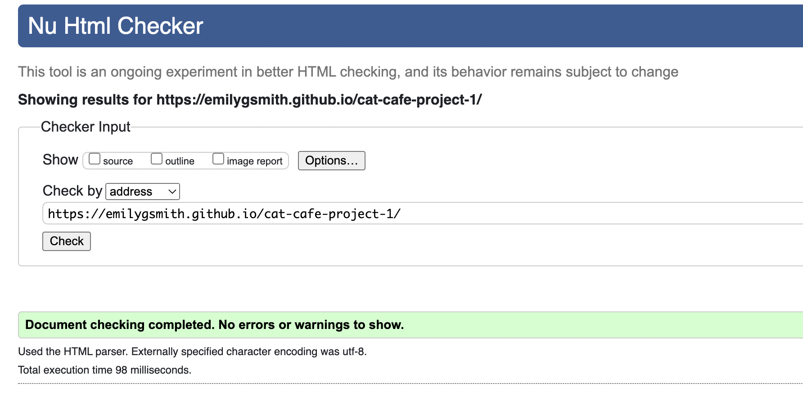

    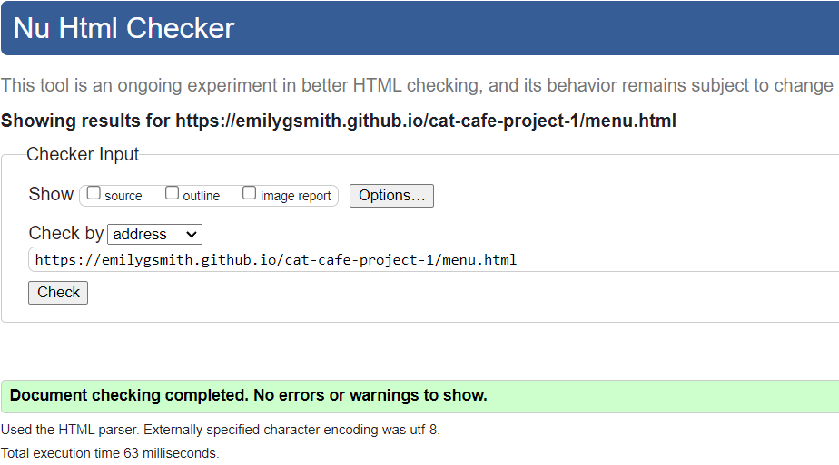

    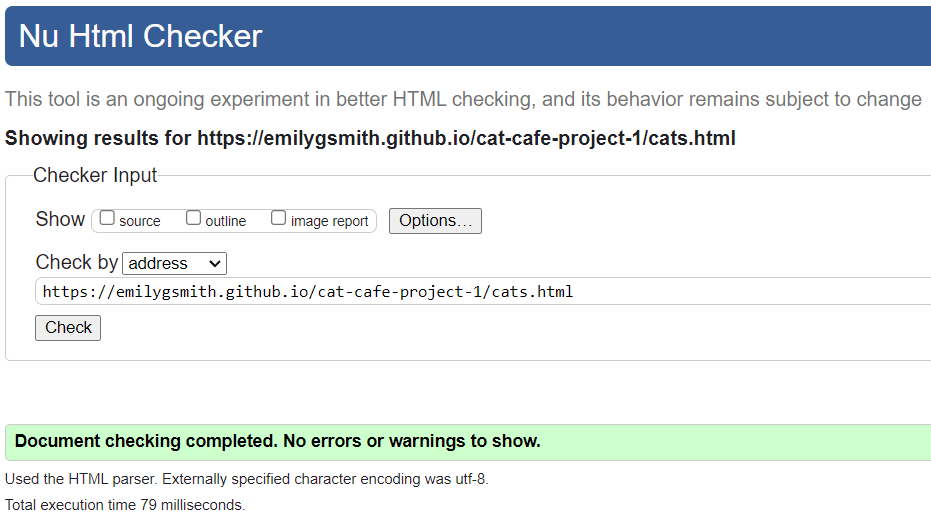

    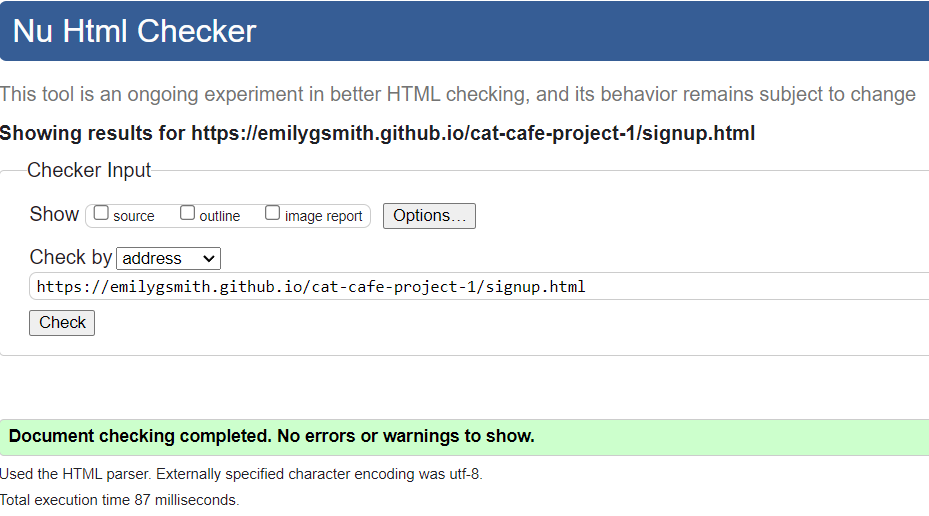

* CSS
    * No errors were returned when checking via the official [Jigsaw validator](https://jigsaw.w3.org/css-validator/).

## Lighthouse Testing
I have tested via the Chrome extension Lighthouse and the site receives high scores across the board for Performance, Accessibility, Best Practises and SEO.

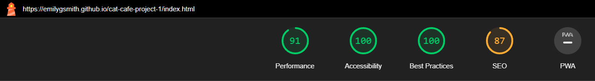

## Debugging
### Navbar
I noticed that the Navbar was extended slightly wider than the rest of the container. I had a div with the class 'row' and a div with the class 'col navbar' within that. I realised I had to add an additional div inside the column div with the class Navbar, and take the Navbar class out of the column div, and this fixed the issue.

### Get in Touch section
When viewing on mobile, the 'Get in Touch' section was too close to the previous section of 'Opening Hours', when there should have been a gap inbetween. I realised that I was missing a paragraph tag between the divs so I added this in to fix it.

## Credit
### Images
* The hero image code came from [this Unsplash post](https://unsplash.com/photos/OjB_lkGKhX8).
* The images of the cats from the 'Meet the Cats' section also came from Unsplash and were resized in GIMP, see direct image links below:
    * [Harry](https://unsplash.com/photos/75715CVEJhI)
    * [Bruno](https://unsplash.com/photos/gKXKBY-C-Dk)
    * [Whiskers](https://unsplash.com/photos/mJaD10XeD7w)
    * [Shira](https://unsplash.com/photos/Tn8DLxwuDMA)
    * [Barry](https://unsplash.com/photos/IuJc2qh2TcA)
    * [Archie](https://unsplash.com/photos/LEpfefQf4rU)
    * I used [TinyPNG](https://tinypng.com/) to compress the hero image to improve ratings on Lighthouse testing.

## Technologies Used
### Languages Used
* [HTML5](https://en.wikipedia.org/wiki/HTML5)
* [CSS3](https://en.wikipedia.org/wiki/CSS)

## Frameworks, Libraries & Programs Used
* [Bootstrap v5.3](https://getbootstrap.com/docs/5.3/getting-started/introduction/) was used to assist with the responsiveness of the site and the styling of certain elements.
* [Google Fonts](https://fonts.google.com/) was used to import the 'Poppins' font into the style.css file which is used throughout the entire website.
* [Font Awesome](https://fontawesome.com/) was used to import social media icons in the footer that I then styled.
* [Balsamiq](https://balsamiq.com/) was used to create the wireframes for the site.
* [GIMP](https://www.gimp.org/) was used to edit text onto the hero image, as I was able to download and import the Poppins font to ensure an element of consistency. It was also used to re-size images.
* [Lighthouse](https://chrome.google.com/webstore/detail/lighthouse/blipmdconlkpinefehnmjammfjpmpbjk?hl=en) was used to test performance, accessibility, best practise and SEO on the site.